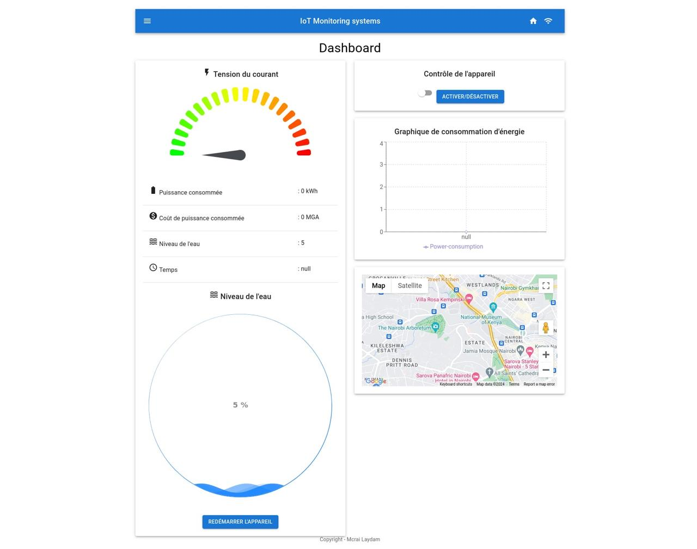

# IoT Dashboard

This project is an IoT dashboard that allows visualization and analysis of data from various connected devices.



## Features

- Real-time IoT data collection
- Data visualization using charts and tables
- Predictions using the Prophet model
- Intuitive and responsive user interface

## Prerequisites

- Python 3.7+
- Node.js and npm (for the user interface)

## Installation

1. Clone the repository:
   ```
   git clone https://github.com/mcrai-dev/iot-dashboard.git
   cd iot-dashboard
   ```

2. Install Python dependencies:
   ```
   pip install -r requirements.txt
   ```

3. Install JavaScript dependencies:
   ```
   npm install
   ```

4. Download the Prophet model:
   The Prophet model (`prophet_model.pkl`) is not included in this repository due to its size.
   Download it from [INSERT DOWNLOAD LINK HERE] and place it in the `model/prophet_models/` folder.

## Configuration

1. Ensure that the `prophet_model.pkl` file is correctly placed in the `model/prophet_models/` folder.
2. Check that the `.env` file contains the correct environment variables (see `.env.example` for an example).

## Usage

1. Launch the backend server:
   ```
   python app.py
   ```

2. In a new terminal, start the user interface:
   ```
   npm start
   ```

3. Open your browser and go to `http://localhost:3000`

## Project Structure

- `app.py`: Main server application
- `model/`: Contains prediction models
  - `prophet_models/`: Folder for the Prophet model (to be downloaded separately)
- `static/`: Static files for the user interface
- `templates/`: HTML templates
- `src/`: React user interface source code

## Troubleshooting

If you encounter issues when running the dashboard:
1. Verify that all dependencies are installed.
2. Make sure the Prophet model is correctly downloaded and placed.
3. Check the server and client logs for specific error messages.

## Contributing

Contributions are welcome! Feel free to open an issue or submit a pull request.

## License

This project is licensed under the MIT License. See the [LICENSE](LICENSE) file for details.
